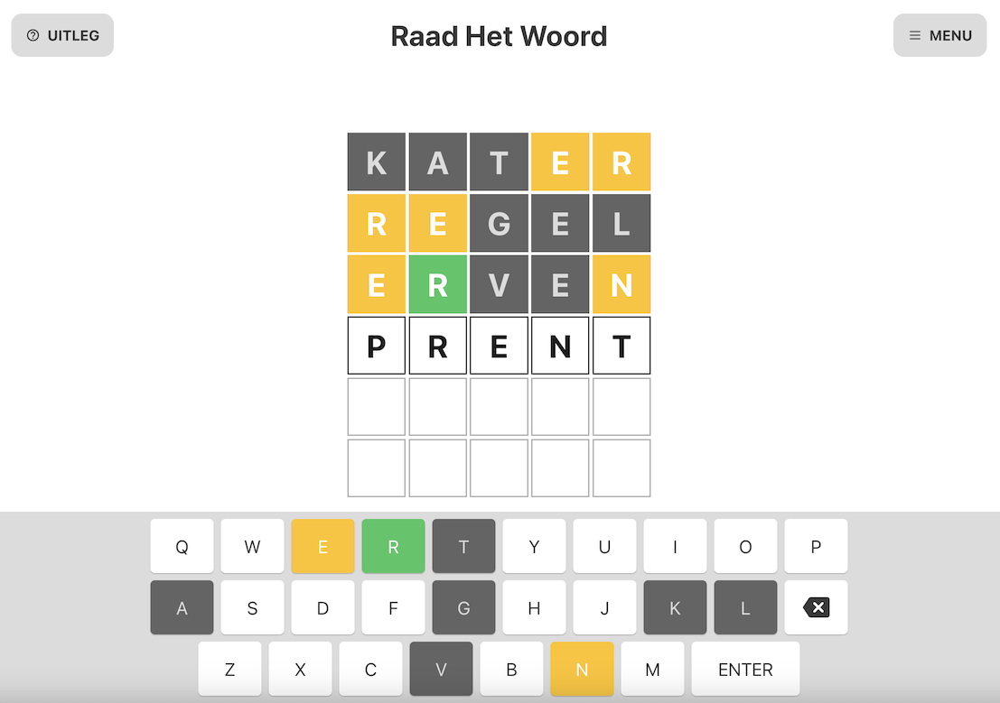

# Raad Het Woord - *a Dutch version of Wordle created with React*

Last update: June 14th 2023  
 
## Table of contents

- [Overview](#overview)
  - [The project](#the-project)
  - [Screenshot](#screenshot)
  - [Links](#links)
  - [Built with](#built-with)
  - [What I learned](#what-i-learned)
  - [The next step](#the-next-step)
  - [Useful resources](#useful-resources)
- [Author](#author)
- [Acknowledgments](#acknowledgments)

## Overview

### The project

Mainly because I wanted to improve my React skills, I set myself up for a challenge to build my own version, in Dutch, of the popular Wordle game. 
I did build a version of Wordle before but that was in Vanilla JS. It was a Christmas themed version that I used as a Christmas Card, which I now used as a starting point for the core functionalities of this new React version. (Although I didn't reuse much of the logic I wrote back then, it was nice I had already figured out the main mechanics of the game.)

Besides rewriting it's core functionality in React, I also wanted to expand the new version's features so it could match up with existing versions of the game on the web. For me this came down to the following wish list of features:
- ANIMATIONS: the tiles had to turn on reveal and the dialog screen had to fade-in and out smoothly
- SETTINGS: the possibility to toggle animations, dark mode, high contrast and bigger keyboard characters on or off
- PREFERED COLOR SCHEME: using the users preference to start off with a light or dark color scheme
- STORING STATISTICS: using local storage to save progress and present them in a user friendly way
- SUGGEST NEW WORDS: creating a form with which users can give suggestions for words they think should be in the game

As the project grew I decided to purchase a domain name and install Google Analytics, so creating a cookie consent banner and the possibility to opt-out of the cookies was an extra feature that had to be created. 
    
For the design of the UI I took a deepdive into the CSS of an existing version of the game (from *De Volkskrant*), because I really wanted to focus on the React side of this project.

### Screenshot

### Links

- Live Site URL: [https://raadhetwoord.nl](https://raadhetwoord.nl)

### Built with

- React 
- CSS Flexbox
- AJAX form submission
- [useLocalStorage custom hook by Robin Wieruch](https://www.robinwieruch.de/react-uselocalstorage-hook/)
- [React GA4 package](https://www.npmjs.com/package/react-ga4)
- [React Cookie Consent bar by Rick van Lieshout](https://github.com/Mastermindzh/react-cookie-consent)

### What I learned
This project was all about getting to know React better and building my own app from scratch using React. That by itself was a great experience, but in the process I came across so many small challenges that taught me skills I did not have before I started out this project. 

In no particular order, these are things I am now capable off that I could not do before this project:
- using `AJAX` to submit forms to my Netlify account
- implementing Google Analytics through the React-GA4 package
- storing sensitive data in a `.env` file (locally and on the Netlify server)
- implementing a cookie consent banner and writing a cookie statement
- using custom hooks like `useLocalStorage()`
- using `window.matchMedia()` to read and respond to a users prefered color scheme
- working with dedicated dialog screens
- using `localStorage` to store and retrieve data locally
- writing a `webmanifest` from scratch
- writing `<meta>` data for SEO and such in the `<head>` section of my `index.html`
- creating and merging branches from and to the master branch to create and test new experimental features 

### The next step  
At this moment I'm learning about `Redux` and how to avoid 'prop-drilling' using `context`, and I think this project would benefit from this concepts in terms of conciseness, DRY and clean code. 

### Useful resources

- [React docs](https://react.dev)
- [Netlify docs](https://docs.netlify.com)
- [*React Hook: useLocalStorage* by Robin Wieruch](https://www.robinwieruch.de/react-uselocalstorage-hook/)
- [react-cookie-consent by Rick van Lieshout](https://github.com/Mastermindzh/react-cookie-consent)
- [*React: enable Google Analytics after a user grants consent* (blog post by Katsiaryna Lupachova)](https://ramonak.io/posts/react-google-analytics-consent)
- [*How to Sync Your React App with the System Color Scheme* (blog post by Glad Chinda )](https://blog.bitsrc.io/how-to-sync-your-react-app-with-the-system-color-scheme-78c0ad00074b)
- [De Volkskrant Puzzels](https://volkskrant.nl/puzzels/) and [woordle.org](https://woordle.org/) for the necessary *how-to* inspiration 
 

## Author

- Website - [Joost Steltenpool](https://jooststeltenpool.nl)
- LinkedIn - [@jooststeltenpool](https://www.linkedin.com/in/jooststeltenpool/)

## Acknowledgments

Raad Het Woord probably wouldn't exist if it wasn't for my wife who kept asking me to build a 'non-Christmas, unlimited' version of the game I made half a year ago.
